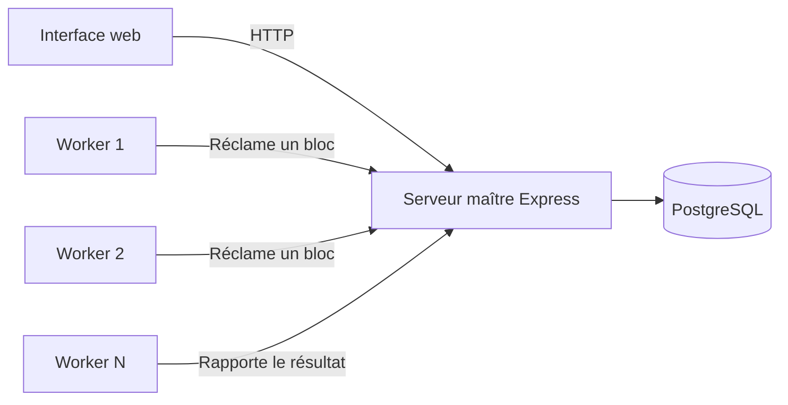

<h1 align="center">🧪 Distributed MD5 Lab</h1>

<p align="center">
  Un laboratoire local pour comprendre la distribution d'un espace de recherche entre plusieurs workers.
</p>

<p align="center">
  
  
  
  
</p>

> [!WARNING]
> Ce projet est exclusivement pédagogique. Il doit être utilisé uniquement sur des condensats que vous avez générés ou pour lesquels vous disposez d'une autorisation explicite. MD5 est obsolète pour le stockage de mots de passe et ne doit pas être utilisé dans une application réelle.

## À propos

Le serveur maître découpe un espace de recherche en blocs enregistrés dans PostgreSQL. Plusieurs processus workers peuvent ensuite réclamer ces blocs, calculer les condensats MD5 et transmettre leur résultat. L'interface web affiche la progression de la dernière session.

## Architecture



L'attribution d'un bloc utilise une mise à jour atomique avec `FOR UPDATE SKIP LOCKED`, ce qui empêche deux workers de récupérer simultanément le même travail.

## Lancer le laboratoire en local

### Prérequis

- Node.js 20 ou version ultérieure ;
- npm 10 ou version ultérieure ;
- Docker pour la base PostgreSQL locale.

```bash
git clone https://github.com/christophersemard/distributed-md5-lab.git
cd distributed-md5-lab
cp .env.example .env
npm run install:all
docker compose up -d postgres
npm run start:master
```

Ouvrir `http://localhost:3000`, puis démarrer un ou plusieurs workers dans d'autres terminaux :

```bash
npm run start:worker
```

Chaque worker reçoit un identifiant aléatoire. La variable facultative `MASTER_URL` permet de modifier l'adresse du serveur maître ; sa valeur par défaut est `http://localhost:3000`.

## Vérifications

```bash
npm test
```

Les tests couvrent la conversion d'un index en chaîne et le calcul du nombre de combinaisons.

## Limites connues

- La recherche est volontairement exhaustive et limitée à deux milliards de combinaisons par session.
- Le protocole entre le maître et les workers n'est ni authentifié ni chiffré : l'environnement doit rester local et de confiance.
- Le projet illustre une file de travail distribuée, pas une solution moderne de récupération de mots de passe.
- Un fichier `.env` a existé dans les premiers commits ; les valeurs correspondaient à une configuration PostgreSQL locale et ne sont plus présentes dans la branche actuelle.

> Projet mis en avant dans la vitrine GitHub ; documentation revue en août 2026.

## Auteur

Projet réalisé par [Christopher Semard](https://github.com/christophersemard) comme expérimentation autour du calcul distribué et de la sécurité des fonctions de hachage historiques.
